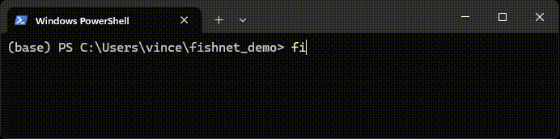

# Align

```bash
fishnet align \
  --bam <basecalls.bam> \
  --pod5 <raw-signal.pod5> \
  --out <output-file>
```



With `Fishnet`, signal-to-sequence alignments are created using the `align` command. It is possible to align both the base-called (query) and (if present) the reference sequences to the signal.

???+ note "General info: Signal-to-sequence alignments"
    A signal-to-sequence alignment <code>A</code> is an array of signal indices, 
    where the pair <code>A[i]</code>, <code>A[i+1]</code> corresponds to the 
    start and end indiced on the signal assigned to base <code>i</code>. The 
    intervals are half-open (start is included, end is not).
    ```text
        Signal:
        ┌──────────────────────────────┐
        │ x                      xxxxx │
        │x x      xxx           x     x│
        │   x    x   xxxx      x       │
        │    xxxx        xxxxxx        │
        └──────────────────────────────┘
        012345678901234567890123456789  (Signal index)

        Sequence:
        A C G T A                 (length = 5)

        Signal-to-sequence:
        [0, 4, 9, 16, 23, 30]     (length = 6)
        ┌────┬─────┬───────┬───────┬───────┐
        │ x  │     │       │       │ xxxxx │
        │x x │     │xxx    │       │x     x│
        │   x│    x│   xxxx│      x│       │
        │    │xxxx │       │xxxxxx │       │
        └────┴─────┴───────┴───────┴───────┘
        │0123│45678│9012345│6789012│3456789│
        │ A  │  C  │   G   │   T   │   A   │
    ```

The alignment requires the following input data:

1. **Raw sequencing data**. Must be stored in **POD5** format
2. **Basecalled data**. Must be stored in a single **BAM** file, as produced by [Dorado](https://github.com/nanoporetech/dorado/) (Note that it must contain the move-table, so base-call with the `--emit-moves` flag!)

Usage examples are provided in [Examples](examples.md).

## Required arguments

The following arguments are required:

| Long flag | Short flag | Explanation | Type |
|-|-|-|-|
| --pod5 | -p | Path(s) to one or more pod5 files and/or directories containing pod5 files (separate multiple paths by space) | Path(s) (file or directory) |
| --bam | -b | Path to a bam file (as given by Dorado; must contain **move tables** for each read) | Path (file) |
| --out | -o | Path to the output file. Must end with .parquet (recommended) or .jsonl depending on the wanted output format | Path (file) |

## Optional arguments

The following arguments are the most relevant optional arguments for most users:

| Long flag | Short flag |Explanation | Type |
|-|-|-|-|
| --rna | -r | Whether the provided data is direct RNA sequencing data. If set, the signal gets reversed for the alignment (dRNA signals are measured 3'-5') | Flag |
| --kmer-table | -k | Path to a [kmer level table](https://github.com/nanoporetech/kmer_models). This is only required if no embedded kmer table can be matched to given data ([more information](kmer_table_matching.md)) | Path (file) |
| --alignment-type | -a | Which type(s) of alignment to generate. Can be '**query**' (Default) to align the signal to the base-called sequence, '**reference**' to align to the reference sequence (if mapped)or '**both**' to do both. | Enum (`query`, `reference`, `both`) |
| --threads | -t | Number of parallel threads to use. Default: **8** | int |
| --force-overwrite | -f | If set and an output file already exists, this file will be overwritten. Raises an error otherwise | Flag |

For the sake of simplicity, the table shows only a subset of the optional arguments. For an overview of all arguments, see [Command line arguments](command_line_arguments.md).

## Output

The output format is determined by the file extension provided in the output file path. Available formats are [Parquet](https://parquet.apache.org/docs/overview/) (`.parquet`) and [JSONL](https://jsonlines.org/) (`.jsonl`) format. Parquet format is recommended as it is more efficient due to compression and chunked writing/reading.

The exact output structure depends on the given values for the `--alignment-type` and `--output-level` flags. For a detailled overview on which columns are present with which settings, see [Output formats](output_formats.md).

## Algorithm details

The sequence-to-signal alignment is calculated in a two step process. An initial alignment is set up from the move table generated during base-calling. Afterwards, the alignment can be refined in an iterative approach where the signal boundaries are shifted to minimize the distance between the observed and expected signal intensities.

For a detailed description of all steps, see [Algorithm details](algorithm_details.md).
