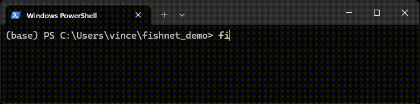

# Reformat

```bash
fishnet reformat \
  --alignment <alignments.parquet> \
  --pod5 <raw-signal.pod5> \          # See "Pod5 input" below
  --motifs <motif> \                  # See "Filter arguments" below
  --out <output-file>
```



After aligning signals to sequences, the alignments consists only of signal indices, not the actual signal chunks. Fishnet provides the `reformat` command to process previously calculated alignments with the signals into formats that can easily used for further downstream processing or analyses. 

Usage examples are provided in [Examples](examples.md).

### Required arguments

| Long flag | Short flag | Explanation | Type |
|-|-|-|-|
| --alignment | -a | Path to a parquet file produced by `fishnet align` | Path (file) |
| --out | -o | Path to the output file. Must end with .parquet (recommended) or .tsv depending on the wanted output format | Path (file) |

#### Pod5 input (optional, but recommended):

| Long flag | Short flag | Explanation | Type |
|-|-|-|-|
| --pod5 | -p | Path(s) to one or more pod5 files and/or directories containing pod5 files (separate multiple paths by space) | Path(s) (file or directory) |

This is only required if the alignment file does not contain the raw signal (this is done by setting `--output-level 3` in the `align` command). 
Not writing the signal to the alignment file is recommended as it is less efficient to store the signal in PARQUET format instead of compressed POD5 format.

#### Filter arguments (one is required):

To reduce the amount of processing required and focus only on bases of interest, the `reformat` module implements different filtering options. 

Reference-to-signal alignments can be filtered by **reference regions of interest**. Alternatively, both query-to-signal and reference-to-signal alignments can be filtered by **motifs of interest**.

Only parts of a read that overlap with a region of interest are further processed.

| Long flag | Short flag | Explanation | Type |
|-|-|-|-|
| --ref-regions | -r | Filter input data for one or more reference region(s). Each must be in the format `<REF-NAME>:<REF-START>-<REF-END>` (Start and end are 1-based coordinates and inclusive). | String(s) |
| --bed-file | -R | Filter input data for reference regions from bed file. Must follow bed-style coordinate conventions (0-based, start inclusive, end exclusive) | Path (file) |
| --positions-of-interest | -P | Filter input data for one or more positions of interest. Each must be in the format `<REF-NAME>:<REF-SITE>-<HALF-SIZE>`, where <HALF-SIZE> determines the number of bases up- and downstream from the site that are of interest. Site coordinate is 1-based | String(s) |
| --motifs | -m | Filter input data for reference regions from bed file. Must follow bed-style coordinate conventions (0-based, start inclusive, end exclusive) | String(s) |
| --bed-file | -R | Filter input data for reference regions from a FASTA file. Each motif must be a separate entry. Sequences must contain only 'A', 'C', 'G' and 'T'/'U' | Path (file) |

### Optional arguments

The following arguments are the most relevant optional arguments for most users:

| Long flag | Short flag | Explanation | Type |
|-|-|-|-|
| `--pod5` | `-p` | POD5 input(s). Required if alignment file lacks raw signal. Multiple are allowed | Path(s) (file or directory) |
| `--rna` | - | Set if direct RNA POD5 file(s) are provided (reverse signal) | Flag |
| `--alignment-type` | - | Set only if the alignment file contains both query- and reference to signal alignments. Set to determine which type will be processed. `query` and `reference` are allowed | Enum (`query`, `reference`) |
| `--strategy` | `-s` | How to reformat the data. See [Reformatting strategies](#reformatting-strategies) for more information | Enum (`stats`, `interpolate`) |
| `--output-shape` | - | How to shape the output data. See [Output formats](#output-formats) for more information | Enum (`melted`, `exploded`, `nested`) |
| `--threads` | `-t` | Number of parallel threads to use. Default: **8** | int |
| `--force-overwrite` | `-f` | If set and an output file already exists, this file will be overwritten. Raises an error otherwise | Flag |

For the sake of simplicity, the table shows only a subset of the optional arguments. For an overview of all arguments, see [Command line arguments](command_line_arguments.md).

### Reformatting strategies

There are two reformatting strategies implement: 

1. **Base-wise statistics**: Calculates statistics that represents the signal assigned to a given base. 
    - This is the default strategy. Can be exlicitly set via the `--strategy "stats"` flag
    - One or more statistics can be specified via the `--stats <stats>...` flag (default: `mean std dwell`). 
    - Available statistics are: **Mean**/**Median**/**Stand. dev.** of the signal intensity, **dwell time** (number of measurements assigned to the base) and **signal-to-noise ratio** (mean / std. dev.)

2. **Interpolation**: Reshapes the signal for each base into a uniform number of samples using linear interpolation.
    - Can be chosen via the `--strategy "interpolate"` flag
    - The number of interpolated samples can be set via the `--target-size <target-size>` flag (default: `30`)

See [Reformatting strategies](reformatting_strategies.md) for more details.

### Output formats

The reformatted data can be written to compressed `parquet` or simple `TSV` format. Since TSV is uncompressed, parquet format is recommended. To account for different downstream processing and analyses, there are three output formats to choose from:

1. **Melted**: Long format containing one row for each base. Useful for visualization with ggplot2/seaborn.
2. **Exploded**: Wide format containing one row for each read-region pair. All values for all bases appear as separate columns. Here all regions need to have the same length. Useful for machine-learning task, e.g. clustering.
3. **Nested**: One row for each read-region pair. Fields store lists or 2D arrays. Only available for `parquet` output

See [Output formats](output_formats.md) for more details. 
