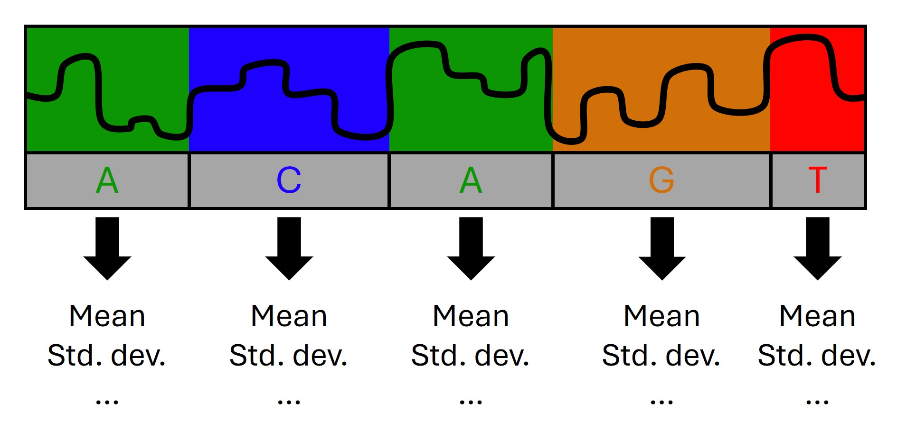
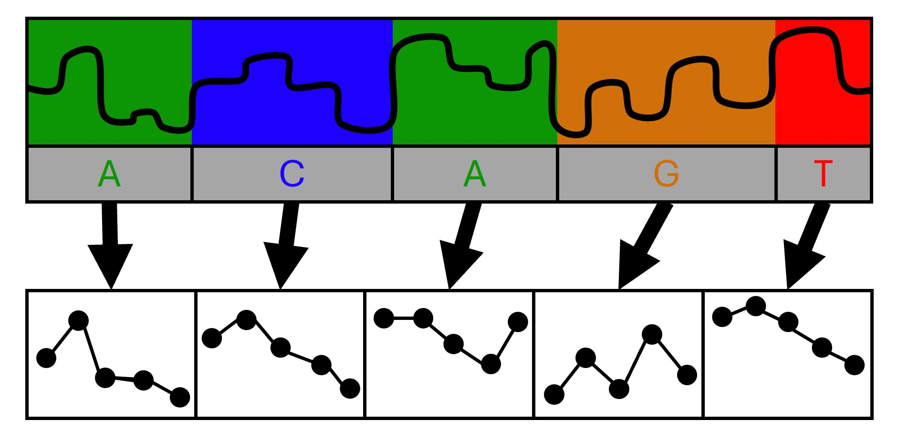

# Reformatting strategies
Two main strategies are available:
## 1. Base-wise Statistics



Each signal segment aligned to a base of interest is summarized into statistics that represent its characteristics.

| **Statistic**     | **Description**                                            |
| ----------------- | ---------------------------------------------------------- |
| `mean`            | Mean signal intensity                                      |
| `median`          | Median signal intensity                                    |
| `std`             | Standard deviation of signal intensity                     |
| `dwell`           | Dwell time (number of signal samples assigned to the base) |
| `signal-to-noise` | Signal-to-noise ratio (`mean / std`)                       |

This is the default strategy, but can be enabled explicitly with `--strategy stats`. By default, `mean`, `std`, and `dwell` are calculated.
You can specify a custom subset via:
```bash
--stats <STAT-A> <STAT-B> ...
```

## 2. Interpolation into uniform shapes



Instead of condensing each segment into statistics, the signal is reshaped into a **fixed number of samples per base** using linear interpolation.
This allows direct comparison or machine-learning-based analysis across bases.

To select this strategy, set `--strategy interpolate`. The number of samples per base can be tuned using `--target-size <NUM-SAMPLES>` (default: 30)

Upsampling or downsampling is applied as needed.